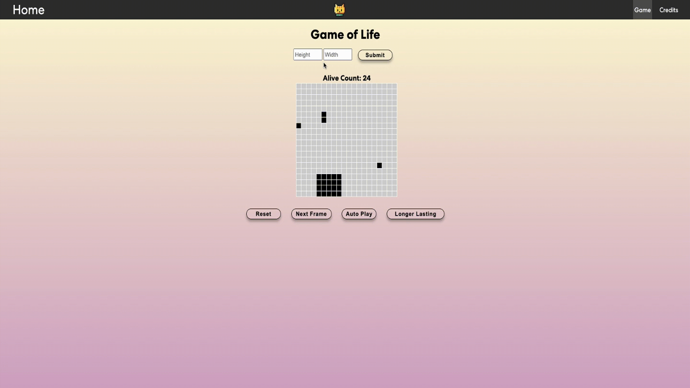
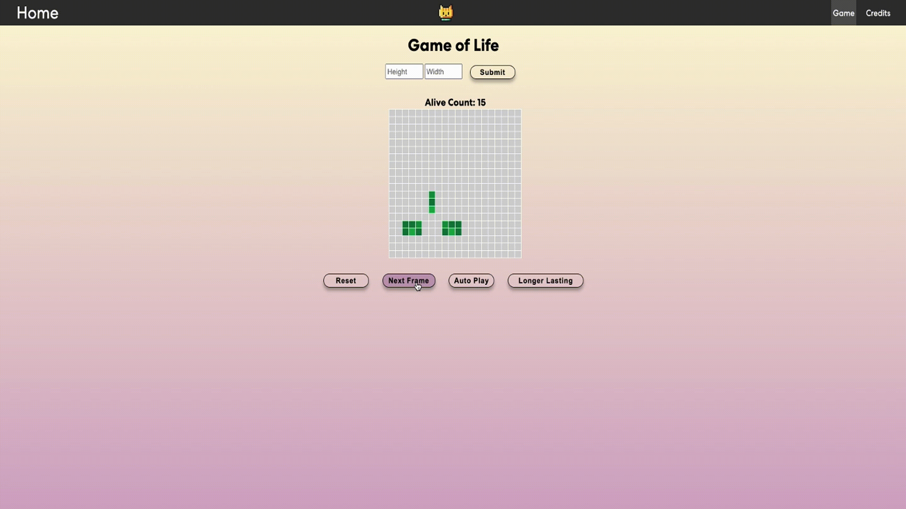
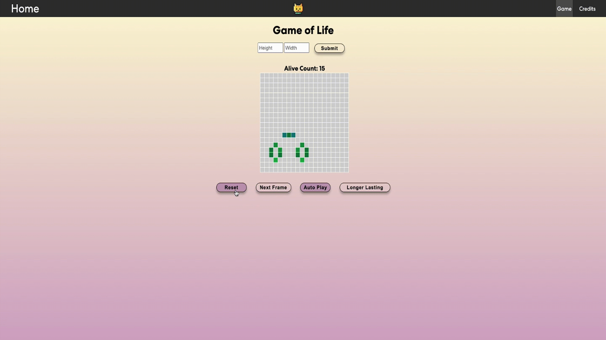

# 🤖 Conway's Game of Life

This repository contains an implementation of Conway's Game of Life in JavaScript and React.


## Core Functionality
Conway’s Game of Life (or just, Life, as I will call it) is a game that is “played” based on a grid system.  Every individual location on the grid can be understood as a cell.  The game, or simulation, occurs over iterations, or generations.  After a generation, a cell may change from living or dead based on how many living or dead neighbors it had in a previous iteration.  A neighbor is any immediately adjacent spot on the grid (horizontal, vertical or diagonal).  We can understand this more clearly with an example and a clear demonstration of the rules.
You are welcome to read about 
Life has 4 simple rules:
1. A living cell with less than two living neighbours dies.
2. A living cell with two or three live neighbours lives.
3. A living cell with more than three live neighbours dies.
4. A dead cell with exactly three live neighbours becomes a live cell, as if by reproduction.

How does this all work for your website?  When users get to the game, they should automatically see a 20X20 grid.  At the top of the page there should be 2 input fields for height and width and a submit button that will reset the game and update the size of the grid.  The range of height and widths should be 3-40 and once the user clicks enter, this will change the size of the grid. If a user selects a number outside of this range, you should show an error message (do NOT use window.alert(...)) and ask to input the correct range.
The following are the parameters for the game.

- When a new grid is created, a random set of cells should be alive (black) or dead (white).  Each cell should have a 5% chance of being alive.
- If a cell is dead and a user clicks on it, it should be marked as a live.
- On the grid page, there should be the option to replace the colors with a heatmap. When a cell is currently alive, it should be the color at one end of the gradient.  When a cell has been dead for 10 or more iterations, it should be the color at the other end of the gradient.  For every iteration in between, it should reflect that spot on the gradient.
- Under the grid, there should be two buttons.  One button will reset the grid (following the description as laid out in the first bullet point) and the second one will progress the simulation by one step (i.e., it will process the game by a single frame.)
- Finally, somewhere on the screen, display the number of currently living cells.


## Innovation

#### 1. Clustered Setup
Conway’s Game of Life works best when cells are clustered together in interesting patterns.  Think of/research and then implement an algorithm that will cluster cells together so that while only about 5-10% of the grid is alive, those cells are more likely to be close together.

#### 2. Autoplay Feature
Underneath the grid, next to the “Next Frame” button, add an autoplay button.  This will automatically progress the simulation by a single every 100 millisecond.  When a user presses the button again, the auto play feature should stop.

#### 3. Longer Lasting Cells
Add a toggle somewhere on the page to make the cells “Longer Lasting”.  In this mode, one or two cells (that are set to “die”) instead of the ability to move one grid space (up, down, left, or right) to the closest cell.  These cells have 2 frames to find another cell to survive, or else they will die.  If they reach another cell and survive another round, their 2-frame life will reset.


## Tech Stack

- React
- React-router-dom
- React-bootstrap-icons
- Framer-motion


## Start The Game

To start this project run

```bash
  npm install
```
```bash
  npm run dev
```


## Demo
##### Home Page


##### Game





##### Credits Page


## Contributing Page

If you'd like to contribute to this project, you can:

- Fork the repository
- Create a new branch (git checkout -b feature/my-new-feature)
- Make your changes
- Commit your changes (git commit -am 'Add some feature')
- Push to the branch (git push origin feature/my-new-feature)
- Create a new Pull Request

Please ensure your code follows the existing style conventions and includes appropriate tests.
## Related

[Conway's Game of Life Wiki](https://en.wikipedia.org/wiki/Conway%27s_Game_of_Life)

